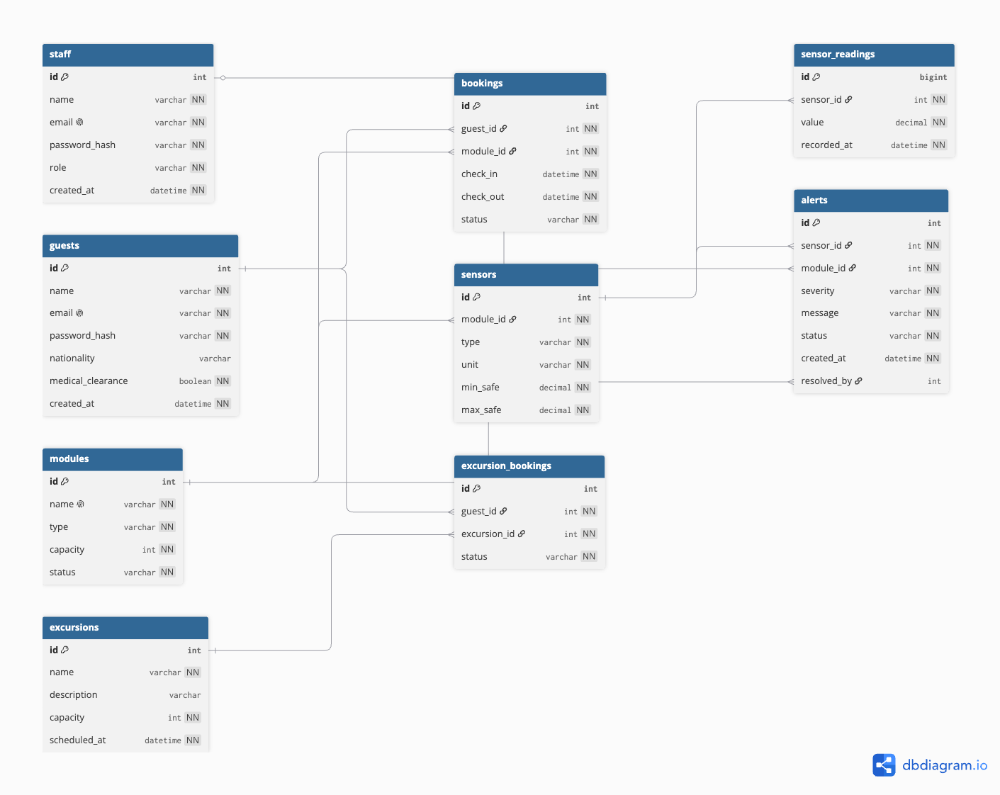
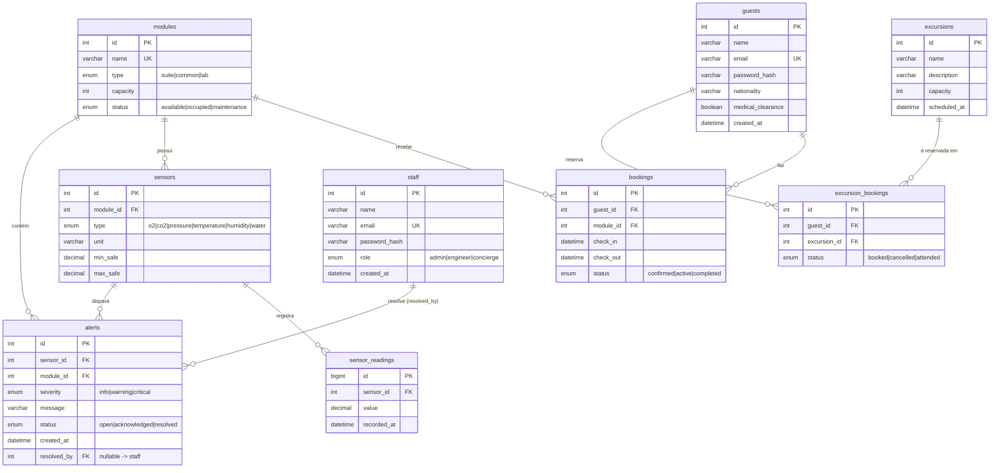

# Diagrama ER - SpaceStay (Parte 1: Modelo de Banco de Dados)

Modelo relacional do hotel orbital SpaceStay: 9 entidades (bem além do mínimo de 4
exigido), cobrindo hospedagem, telemetria de suporte de vida (IoT) e excursões.

> Como gerar a imagem para o PDF: o bloco Mermaid abaixo já renderiza no GitHub e no
> VS Code. Para uma imagem mais caprichada para o relatório, cole o bloco DBML (mais ao
> final) em <https://dbdiagram.io> e exporte como PNG/PDF.

---

## 0. Diagrama exportado (imagem usada no relatório PDF)



> Gerado no [dbdiagram.io](https://dbdiagram.io) a partir do bloco DBML da seção 3.

---

## 1. Diagrama (Mermaid)



---

## 2. Relacionamentos e cardinalidades

| Relação | Cardinalidade | Regra de negócio |
|---|---|---|
| `guests` para `bookings` | 1 : N | Um hóspede faz várias reservas ao longo do tempo. |
| `modules` para `bookings` | 1 : N | Um módulo (quarto) recebe várias reservas em períodos diferentes. |
| `guests` e `modules` | N : N (via `bookings`) | A hospedagem é a relação muitos-para-muitos entre hóspede e módulo, com período e status. |
| `modules` para `sensors` | 1 : N | Cada módulo possui vários sensores (a cadeia de telemetria IoT). |
| `sensors` para `sensor_readings` | 1 : N | Cada sensor registra muitas leituras ao longo do tempo. |
| `sensors` para `alerts` | 1 : N | Uma violação de limite gera um alerta vinculado ao sensor. |
| `modules` para `alerts` | 1 : N | O alerta também aponta o módulo (facilita o painel da equipe). |
| `staff` para `alerts` | 1 : N (opcional) | Via `resolved_by`: quem reconheceu ou resolveu o alerta (pode ser nulo). |
| `guests` e `excursions` | N : N (via `excursion_bookings`) | O muitos-para-muitos clássico: um hóspede reserva várias excursões e cada excursão recebe vários hóspedes. |

Duas relações N:N estão modeladas com tabelas associativas:
- Hospedagem (`guests` e `modules`) na tabela `bookings` (com período e status).
- Excursões (`guests` e `excursions`) na tabela `excursion_bookings` (junção pura).

---

## 3. Versão DBML (para dbdiagram.io)

Cole o bloco abaixo em <https://dbdiagram.io> para gerar a imagem do diagrama.

```dbml
// SpaceStay - Modelo de Banco de Dados (MySQL/MariaDB)

Table guests {
  id int [pk, increment]
  name varchar [not null]
  email varchar [unique, not null]
  password_hash varchar [not null]
  nationality varchar
  medical_clearance boolean [not null, default: false]
  created_at datetime [not null]
}

Table staff {
  id int [pk, increment]
  name varchar [not null]
  email varchar [unique, not null]
  password_hash varchar [not null]
  role varchar [not null, note: 'admin | engineer | concierge']
  created_at datetime [not null]
}

Table modules {
  id int [pk, increment]
  name varchar [unique, not null]
  type varchar [not null, note: 'suite | common | lab']
  capacity int [not null]
  status varchar [not null, note: 'available | occupied | maintenance']
}

Table bookings {
  id int [pk, increment]
  guest_id int [not null, ref: > guests.id]
  module_id int [not null, ref: > modules.id]
  check_in datetime [not null]
  check_out datetime [not null]
  status varchar [not null, note: 'confirmed | active | completed']
}

Table sensors {
  id int [pk, increment]
  module_id int [not null, ref: > modules.id]
  type varchar [not null, note: 'o2 | co2 | pressure | temperature | humidity | water']
  unit varchar [not null]
  min_safe decimal [not null]
  max_safe decimal [not null]
  indexes {
    (module_id, type) [unique]
  }
}

Table sensor_readings {
  id bigint [pk, increment]
  sensor_id int [not null, ref: > sensors.id]
  value decimal [not null]
  recorded_at datetime [not null]
  indexes {
    (sensor_id, recorded_at)
  }
}

Table alerts {
  id int [pk, increment]
  sensor_id int [not null, ref: > sensors.id]
  module_id int [not null, ref: > modules.id]
  severity varchar [not null, note: 'info | warning | critical']
  message varchar [not null]
  status varchar [not null, note: 'open | acknowledged | resolved']
  created_at datetime [not null]
  resolved_by int [ref: > staff.id, note: 'nullable']
}

Table excursions {
  id int [pk, increment]
  name varchar [not null]
  description varchar
  capacity int [not null]
  scheduled_at datetime [not null]
}

Table excursion_bookings {
  id int [pk, increment]
  guest_id int [not null, ref: > guests.id]
  excursion_id int [not null, ref: > excursions.id]
  status varchar [not null, note: 'booked | cancelled | attended']
  indexes {
    (guest_id, excursion_id) [unique]
  }
}
```
